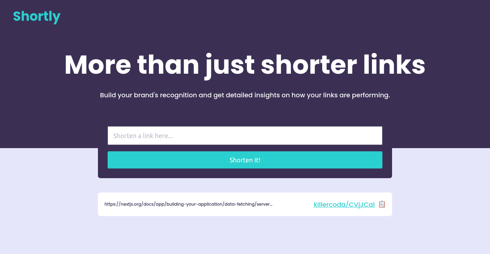
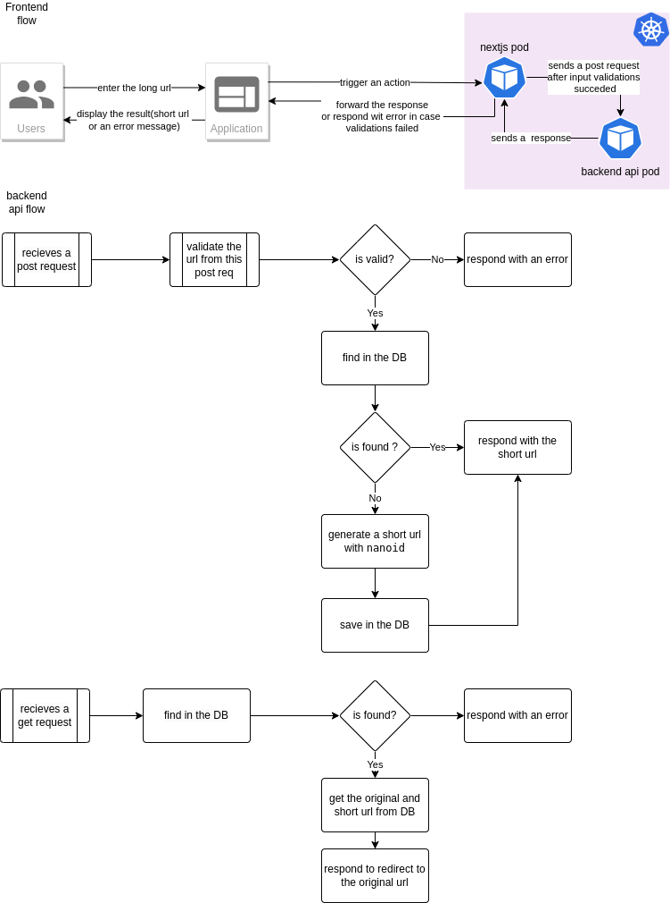
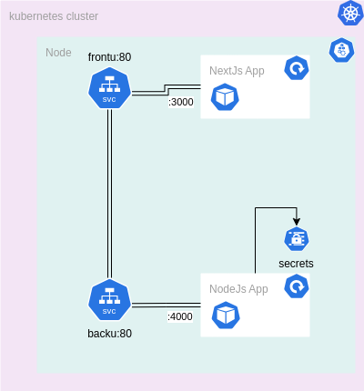

# URL Shortener Project Documentation

## Overview

The URL Shortener project here is my solution for the freecodecamp challenge as a part of the "Back End Development and APIs course" also for "Coding Challenges By John Crickett" comprising a frontend built with Next.js and a backend API. This documentation outlines the architectural design, the flow of the application, and the deployment process on Kubernetes.



### Frontend (Next.js)

The frontend is designed using Next.js, a React-based framework, and is responsible for providing a user-friendly interface for URL shortening. It consists of two main parts:

#### Client-Side Rendered components
- **Form:** This component allows users to input long URLs that they wish to shorten.
- **List:** Displays a list of shortened URLs generated by the user on his browser(the saveed in the local storage).

#### Server-Side Action
- The server-side of the Next.js app includes an action triggered by the form. This action sends an API call to the backend API for URL shortening.

### Backend API

The backend API handles the core functionality of the URL shortener. It is responsible for:

- Generating short URLs using the `nanoid` library, creating unique 7-character strings.
- Storing URL data in MongoDB Atlas, a cloud-based MongoDB database, utilizing a schema with fields for `original_url` and `short_url`.
- Redirecting users from the shortened link (`{domain-name}/api/shorturl/{shorturl}`) to the original URL.

## Application Flow



1. **User Interaction:**
   - Users interact with the client-side rendering of the Next.js app, entering long URLs into the form.

2. **Server-Side Action:**
   - Upon submitting the form, a server-side action is triggered to send an API call to the backend API.

3. **Backend Processing:**
   - The backend API generates a short URL and stores it in the database.

4. **Response to Client:**
   - The server responds to the server action with the generated short URL and then returns the short URL to the client and added to the local storage.

5. **User Access:**
   - Users can access the shortened URL, leading to a redirection to the original URL.

## Deployment to Kubernetes

For deploying the URL Shortener project to Kubernetes, the following steps are involved after accessing the k8s_files folder and having a kubernetes up and runing:


1. **add your mongodb uri:**
   - add the uri link of your mongodb to the secret file under the stringData section. you can follow this guide [here](https://www.mongodb.com/docs/manual/reference/connection-string/) to get the uri link.

2. **Apply Kubernetes files:**
   ```bash
   kubectl apply -f .
   ```
and now  the apps are deployed and runing.



## CI/CD Process

This project leverages GitHub Actions for Continuous Integration (CI) and ArgoCD for Continuous Deployment (CD), ensuring a streamlined and automated development pipeline.

### CI Workflow

The CI workflow for both the frontend  and the backend api  is triggered on pushes to the main branch, pull requests to the main branch only when there is a change in their respective folders, or tag creation following the "v*..-fr" pattern for the frontend app and the "v*..-bk" pattern for the backend api. The workflow includes two main jobs:

#### Build Job

- **Name:** `build`
- **Purpose:** Build and publish Docker images.
- **Steps:**
  - Checkout the source code.
  - Use Docker metadata action to generate Docker tags based on various events.
  - Login to Docker Hub securely.
  - Set up Docker Buildx for efficient multi-platform builds.
  - Build and push Docker images to the specified Docker Hub repository.

#### Deploy Release Job

- **Name:** `deploy-release`
- **Purpose:** Deploy the release by updating Kubernetes deployment manifests.
- **Conditions:** Only triggered on tag creation.
- **Steps:**
  - Checkout the source code.
  - Modify the deployment YAML file to update the image tag with the newly created release tag.
  - Configure Git and commit the changes.
  - Push the changes to the repository.


So basically, when a developer make some changes in one of the apps folders , commit the work  and push to the repo the build job will be triggered creating a new docker image but it is not for deployment. the developer needs to create a new tag version and push it to github in order to both the build job and deploy-release  to be triggered and thus creating a new image with the version tag and changing it in the deployment kubernetes manifest.

### CD Process

The ArgoCD application manifest, located at `k8s_files/argocd/application.yaml`, specifies the deployment configuration for the URL Shortener. ArgoCD continuously monitors the GitHub repository (every 3 minutes a less you configured a webhook) and automatically applies changes to the Kubernetes cluster.

## Notes

- the architectural choices here are just to strengthen my learning in some technologies.at least to my knowledge, there is no need here for such a simple application to be decoupled to  microservices yes maybe i wanted to separate the api from the frontend app which is built using next js (already a fullstack framework i know) but still a monolith approach would be sufficient.  
  
- Also another thing needs to be mentioned. It is better to separate the k8s deployments manifests, te front app code and the backend api code into different repositories i think it is better for managing the project. 